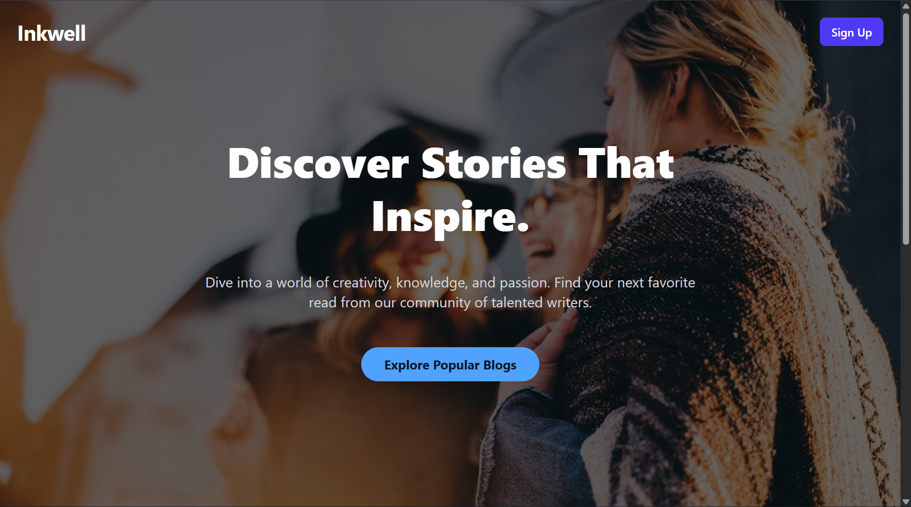

# BlogSite: A Modern Full-Stack Blogging Platform



Welcome to BlogSite, a feature-rich, full-stack blogging application built with the MERN stack (MongoDB, Express.js, React, Node.js). This platform provides a seamless and intuitive experience for writers to share their stories and for readers to discover and engage with content. The application features a sleek, modern UI with a dark mode, full CRUD (Create, Read, Update, Delete) functionality for blogs, and interactive features like comments and likes.

---

## ✨ Key Features

- **Full CRUD for Blogs**: Users can create, read, update, and delete their own blog posts.
- **Secure User Authentication**: JWT (JSON Web Token) based authentication for sign-up and sign-in, ensuring that users can only modify their own content.
- **Rich Text Editor**: A clean and simple interface for writing and editing blog posts.
- **Image Uploads**: Seamless banner image uploads for blogs, powered by Cloudinary for scalable cloud storage.
- **Interactive Engagement**: Users can like posts and leave comments to interact with authors and other readers.
- **Dynamic Filtering & Searching**:
    - Filter blogs by category.
    - Search for blogs by author.
    - A dedicated "My Blogs" view to see only your own posts.
- **Persistent Dark/Light Mode**: A beautiful, animated theme toggle that remembers the user's preference across sessions using a React Context and `localStorage`.
- **Responsive Design**: A mobile-first design that looks great on all devices, from phones to desktops.
- **Toast Notifications**: Sleek, non-intrusive notifications for actions like successfully deleting a blog.

---

## 🛠️ Tech Stack

This project is divided into two main parts: a React frontend and a Node.js backend.

| Category          | Technology                                                                                                  |
| ----------------- | ----------------------------------------------------------------------------------------------------------- |
| **Frontend** | [React](https://reactjs.org/), [Vite](https://vitejs.dev/), [React Router](https://reactrouter.com/), [Tailwind CSS](https://tailwindcss.com/), [Framer Motion](https://www.framer.com/motion/), [Axios](https://axios-http.com/), [Lucide React](https://lucide.dev/) |
| **Backend** | [Node.js](https://nodejs.org/), [Express.js](https://expressjs.com/), [MongoDB](https://www.mongodb.com/), [Mongoose](https://mongoosejs.com/), [JWT](https://jwt.io/), [bcrypt](https://www.npmjs.com/package/bcrypt), [Cloudinary](https://cloudinary.com/), [Multer](https://github.com/expressjs/multer) |
| **Development** | [Nodemon](https://nodemon.io/) (for backend auto-reloading), [ESLint](https://eslint.org/) (for code linting) |

---

## 🚀 Getting Started

To get a local copy up and running, follow these simple steps.

### Prerequisites

- [Node.js](https://nodejs.org/en/download/) (v16 or later recommended)
- [npm](https://www.npmjs.com/get-npm)
- A [MongoDB Atlas](https://www.mongodb.com/cloud/atlas) account or a local MongoDB installation.
- A [Cloudinary](https://cloudinary.com/) account for image storage.

### Installation & Setup

1.  **Clone the repository:**
    ```sh
    git clone [https://github.com/your-username/blogsite.git](https://github.com/your-username/blogsite.git)
    cd blogsite
    ```

2.  **Setup the Backend (`blog-backend`):**
    ```sh
    cd blog-backend
    npm install
    ```
    - Create a `.env` file in the `blog-backend` root directory and add the following environment variables:
      ```env
      MONGODB_URI=your_mongodb_connection_string
      JWT_SECRET=your_super_secret_jwt_key
      CLOUDINARY_CLOUD_NAME=your_cloudinary_cloud_name
      CLOUDINARY_API_KEY=your_cloudinary_api_key
      CLOUDINARY_API_SECRET=your_cloudinary_api_secret
      ```

3.  **Setup the Frontend (`blog-frontend`):**
    ```sh
    cd ../blog-frontend
    npm install
    ```

### Running the Application

You will need two separate terminal windows to run both the backend and frontend servers concurrently.

1.  **Start the Backend Server:**
    - In your first terminal, navigate to the `blog-backend` directory.
    - Run the development server:
      ```sh
      npm run dev
      ```
    - The server will start on `http://localhost:5000`.

2.  **Start the Frontend Development Server:**
    - In your second terminal, navigate to the `blog-frontend` directory.
    - Run the development server:
      ```sh
      npm run dev
      ```
    - The React application will open in your browser at `http://localhost:5173`.

The frontend is configured with a proxy in `vite.config.js`, so any API calls to `/api` will be automatically forwarded to your backend server.

---

## 📂 Project Structure

The project is organized into a `blog-backend` and a `blog-frontend` directory, promoting a clean separation of concerns.

## 📖 API Endpoints

The backend exposes the following RESTful API endpoints under the `/api` prefix.

| Method | Endpoint                    | Description                       | Protected |
| :----- | :-------------------------- | :-------------------------------- | :-------- |
| `POST` | `/auth/signup`              | Register a new user               | No        |
| `POST` | `/auth/signin`              | Log in a user and get a JWT       | No        |
| `GET`    | `/blog`                     | Get all blog posts                | No        |
| `GET`    | `/blog/:id`                 | Get a single blog post by ID      | No        |
| `POST`   | `/blog`                     | Create a new blog post            | Yes       |
| `PUT`    | `/blog/:id`                 | Update an existing blog post      | Yes       |
| `DELETE` | `/blog/:id`                 | Delete a blog post                | Yes       |
| `PUT`    | `/likes/:blogId/toggle`     | Like or unlike a blog post        | Yes       |
| `GET`    | `/comments/:blogId`         | Get all comments for a blog       | No        |
| `POST`   | `/comments/:blogId`         | Add a new comment to a blog       | Yes       |
| `DELETE` | `/comments/:blogId/:commentId` | Delete a comment from a blog    | Yes       |

---

## 👨‍💻 Author

- **Shivam Patel**
- **Location:** Vadodara, Gujarat, India
- **Date:** August 24, 2025